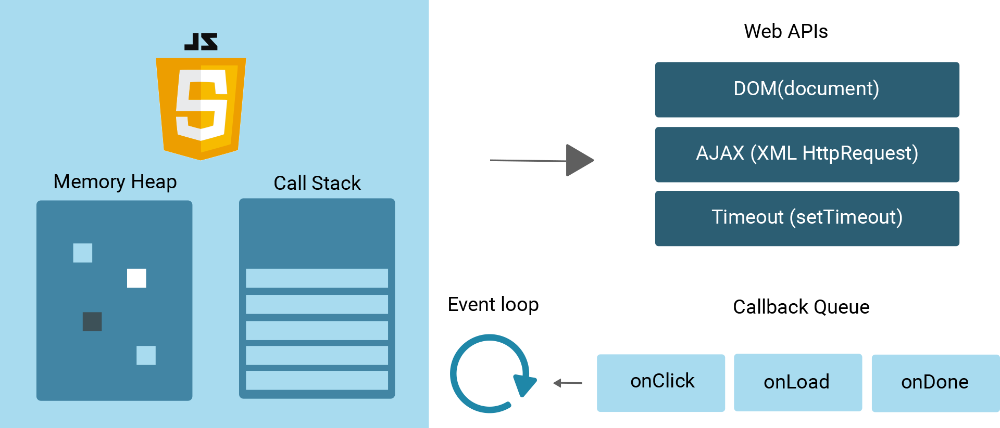
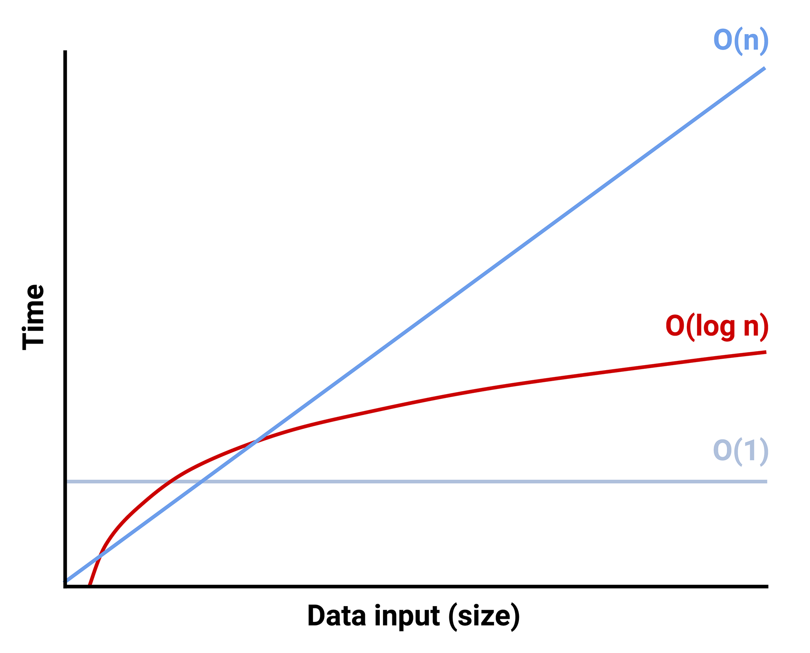

# Study JavaScript Computer Science

## Table of Concept

- [Description](#description)
- [JavaScript Data Structures](#javascript-data-structures)
- [JavaScript Information](#javascipt-information)
- [JavaScript Closure](#javascript-closure)
- [JavaScript Factory-Function](#javascript-factory-function)
- [JavaScript Algorithms](#algorithms)
- [JavaScript Lineral Search](#lineral-search)
- [JavaScript Binary Search](#binary-search)
- [JavaScript Recursion](#recursion)
- [JavaScript Big-O](#big-o)
- [JavaScript Benchmark](#benchmark)
- [JavaScript Bubble Sort](#bubble-sort)
- [Javascript Quick Sort](#quick-sort)
- [JavaScript Merge Sort](#merge-sort)
- [Pseudocode](#pseudocode)

## Description

This is a GitHub repository to write down Module 17 from Columbia Boot Camp which exmplains how JavaScript works. From the flow of the application to Asynchronous and Synchronous Functions.

## JavaScript Data Structures

- **Call Stack** - Where JS executes and evalutes the code. Call stack data is being ran by Last In First Out (LIFO)
- **Callback Queue** - Enables JS to handle Asynchronous Functions. Callback Queue is First In First Out (FIFO). It is like a line the order in which they are passed can effect application performance.
- **Memory Heap** - This is where the data is stored.

## JavaScipt Information

- JavaScript is Single-Threaded, which meand is can only execute one line of code at a time.
- **Thread of Execution (TOA)** - Current line of code being executed.
- Functions and Variables are being added to Global Memory.
- Stack Overflow Error Message - Occurs when too many functions are placed into the call stack, exceeding its capacity.
- return statment inside a function is what pops the function off the call stack.
- **Asynchronous Functions** - Run in the background to avoid slowing down a site. Example would be a fetch request, which could be time consuming and will slow down UI due to the fetch request. This is a bad user experience.
- setTimeout() even with a value of 0 will still be delayed due to the code after being ran first.

JavaScript Data Structure

## JavaScript Closure

- **Closure** is when a function is returned. It is a function which returns a function.
- Closures are not exposed to the rest of the application.
- Any variables stored inside a closures lexical environment wont be available to other functions outside of this scope. This is different from global variable which are available to all functions in the program. This is good practice to avoid overriding global variables values. It also keeps the variables private due to not being accessible from everywhere.
- Example in ./Closure/closure.js

## JavaScript Factory Function

- **Factory Function** - are function which return objects. Very similar to closure but they return an object instead of a function.
- Example in ./FactoryFunction/index.js

## Algorithms

- **Algorithms** - are series of steps to solve a problem or perform an action.
- FizzBuzz is an inteview question which had been asked before. It is a program that prints numbers 1 - 100. Every number divisible by 3 will print for Fizz. Every number divisible by 5 will print Buzz. Finally every number divisible by 3 and 5 will print FizzBuzz.

## Lineral Search

- A **lineral Search** looks at every index in sequential order.
- Use break or return to break out of loop to avoid having to run through all numbers in the array if the number we been searchng for has been found.
- Example in /Algorithms/search.js

## Binary Search

- A **Bianry Search** works by continually dividing the data in half based on weather the number you are looking for is greater or less then a chosen middle point.
- Binary Search works only when the data is sorted.
- Example in /Algorithms/binary.js

## Recursion

- A **recursion** is the act of a fucntion calling itself.
- Example in /Algorithms/binary.js

## Big O

- **Big O** is how efficient or inefficient an algorithm performs. O in the Big O stand for order.
- This is used to measue how long a user might have to wait to get the data.

- Linear Search has a growth rate of 0(n).
- Binary Search has a growth rate of 0(log n)

## Benchmark

- **Benchmark** is act of measurering the performance of a progress.
- **Benchmark.js** is a NPM library used for that purpose.
- To install run `$ npm i benchmark`
- To run benchamrk.js `$ node <filename>`
- `stats.mean` tells how long to run in milliseconds.
- You are able to run multiple tests at one time.
- For examples check ./benchmark/index.js and ./benchmark/search.js
- You can see from Benchmark that Binary Search is faster with large data vs Linear Search is faster with smaller data.

## Bubble Sort

- Bubble Sort involves comparing 2 indexes side-by-side. Keeps swapping values until there is no more swaps left to do.
- Bubble Sort is very time consuming after data gets larger. This is known as **Quadratic Complexity (0(n2))**
- Example in ./Sorting/bubble.js

## Quick Sort

- Quick Sort makes 2 arrays and puts numbers greater then pivot point into one array and smaller then in another array. Then it continues to split those arrays into tiny arrays. At the end it takes those arrays sorted and merges them back together.
- Quick Sort is faster the Bubble Search. Its growth rate is 0(n log n)
- Example ./Sorting/quickSort.js

## Merge Sort

- Merge sort is similar to quick sort by also splitting array into 2 arrays. Difference is when comparison and megre are performed.
- **.sort()** is a built in function into JavaScript which sorts arrays for us. This has the best perfomance compare to the Bubble and Quick sort.
- Best performance is 0(n log n)
- Example in ./Sorting/index.js

## Pseudocode

- **Pseudocode** is a way you write out your code in steps which will accomplish the task we are intending to solve.
- Example in ./Interviews/palindrone.js

[Back to Top](#study-javascript-computer-science)
